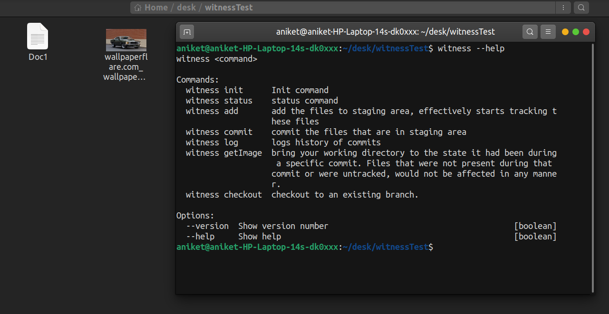
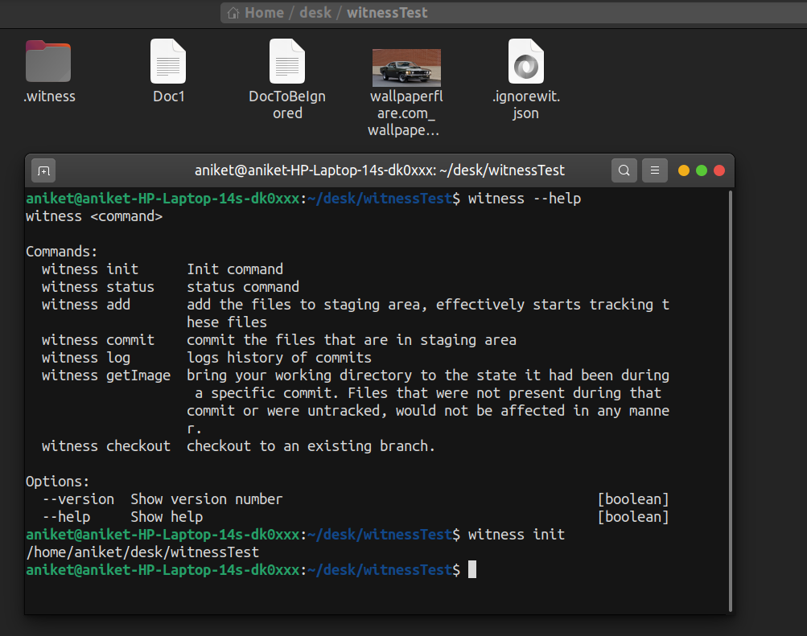
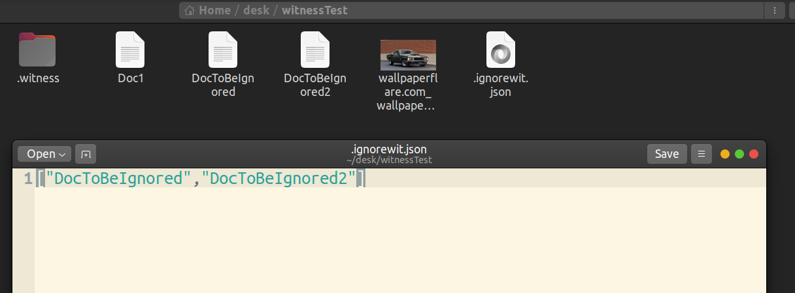
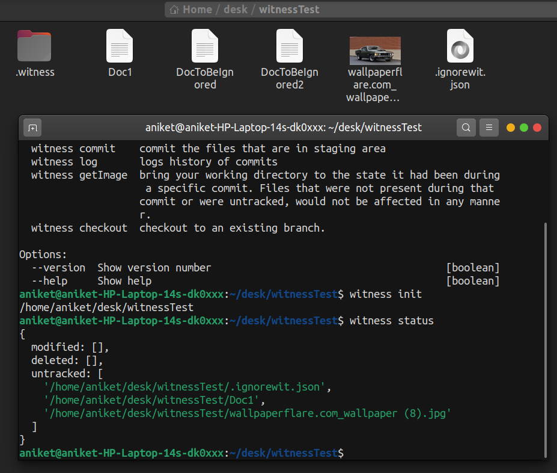
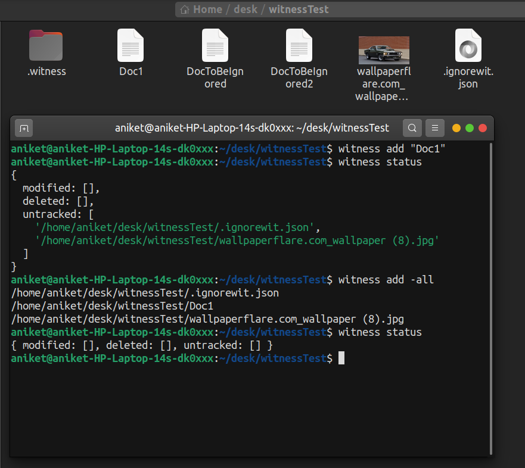
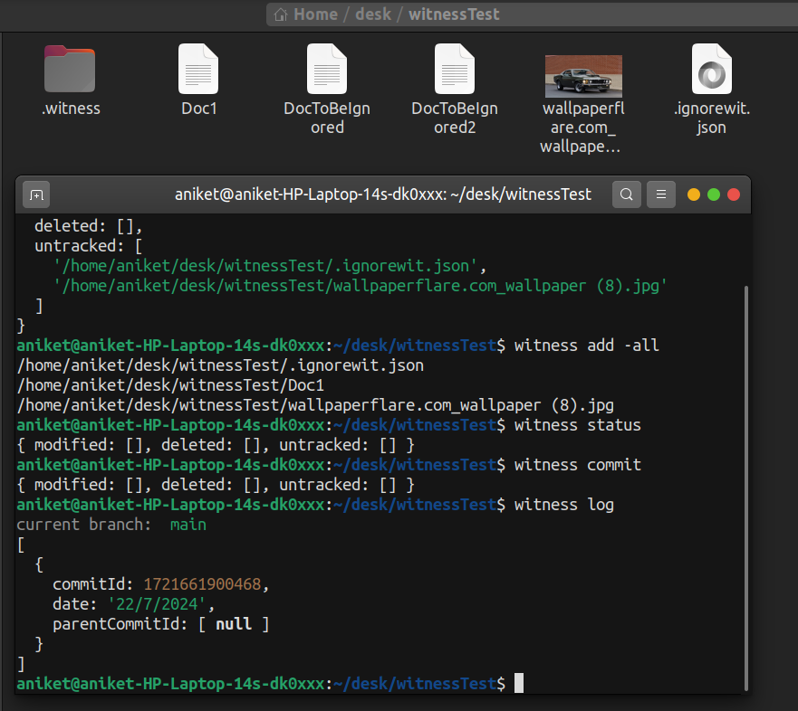
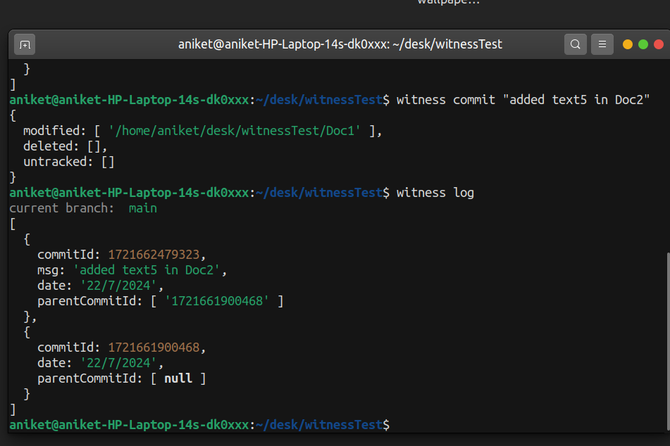
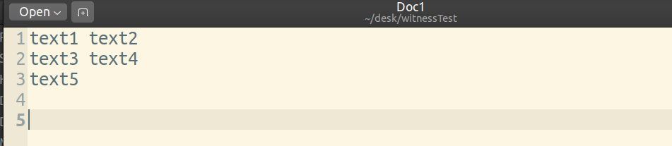
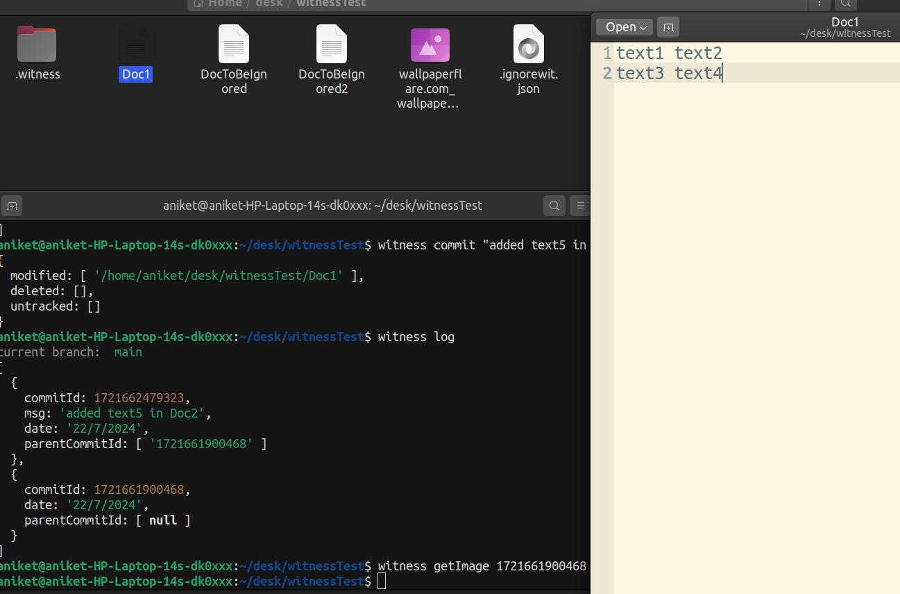
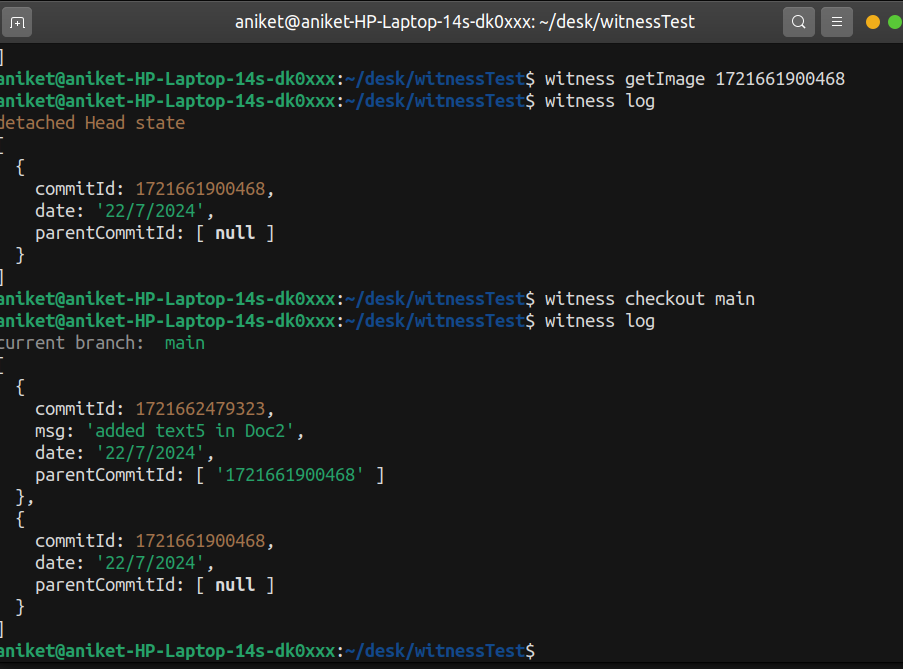

## To install
###### 1. clone the repo
###### 2. go to root directory of project and run `npm update` and then `npm install -g .`

##### its better to use bash terminals on windows :)

this is an attemp to make a simple version control system called Witness.
Its based on popular vsc "git". Its a fun learning project and has helped me in learning about git internals, object databases and linux filesystems.
This project doesn't use git porceilien and plumbing commands but rather approaches the problem at hand from scatch in NodeJs.

Its in beginner stages only and is yet to support branching and merging.

### Commands:
 ##### witness init :     Init command
 ##### witness status :   status command
 ##### witness add :      add the files to staging area, effectively starts tracking these files
 ##### witness commit :   commit the files that are in staging area
 ##### witness log :      logs history of commits
 ##### witness getImage : bring your working directory to the state it had been during a specific commit. Files that were not present during that commit or were untracked, would not be affected in any manner.
 ##### witness checkout : checkout to an existing branch.
\n
### Options:
##### --version  : Show version number                                       [boolean]
##### --help    : Show help                                                 [boolean]

## Images:

#### init

### .ignorewit File
put path of files and folders to not be included in the tracking. enter the paths as string in the array. seperate two entries by a "," inside the array.

### status:

### adding files to staging area:

### commiting and checking commit history

### detached head state
changed content of Doc1 and commited:

after 2nd commit Doc1 looks like:

using commitId of first commit, we will try to restore the state of directory to first commit:
commitId of first commit can be seen in witness log

### moving from detached head state back to a branch head

